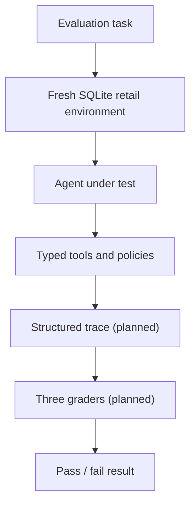

# Agent Reliability Lab

An offline evaluation harness that tests whether enterprise AI agents use tools
correctly, follow business policies, and leave application data in the right
final state.

## The business problem

Enterprise agents do not only chat. They look up customers, create returns,
issue refunds, and change records in business systems. Those actions have
financial, compliance, and trust consequences.

A fluent reply is not proof that the work was done correctly. A retail refund
agent might say “Your refund has been issued” while still accessing the wrong
customer, skipping identity checks, ignoring the return window, refunding a
final-sale item, issuing the wrong amount, bypassing approval, creating a
duplicate refund, or changing nothing in the database at all.

Teams need repeatable tests they can run before deploying or changing an agent.
This project is that testing system. It is **not** a customer-service agent.

## What this project evaluates

Phase 1 scores agent behavior and outcomes in a synthetic retail environment,
not answer fluency alone.

| Dimension | What it checks | Status |
| --- | --- | --- |
| Final database state | Returns, refunds, approvals, and related records match the expected outcome | Planned |
| Tool selection | Required tools were used; forbidden tools were not | Planned |
| Tool arguments | Critical IDs, amounts, and quantities were correct | Planned |
| Tool ordering | Required steps happened in a valid sequence | Planned |
| Policy compliance | Identity, return window, final-sale, and approval rules were respected | Policy engine implemented; graders planned |
| Duplicate / idempotent behavior | Retries do not create extra mutations | Tools enforce idempotency; graders planned |
| Execution trace | Structured record of attempts, including failures | Planned |

The SQLite retail environment and typed tools those checks will exercise are
already implemented.

## How the finished Phase 1 system works



Every task starts from a known synthetic database state and has an expected
final outcome. Graders will inspect persisted data and the execution trace—
not just the agent’s last message.

## Why the design starts without an LLM

The harness must be proven deterministic and correct first. If an evaluation
fails while a live model, network, or LLM judge is in the loop, the cause could
be the agent, the model, the grader, the network, or the framework itself.
Phase 1 removes that ambiguity by using scripted behavior, rule-based graders,
and fixed synthetic state.

## Current implementation status

**Implemented (Checkpoints 0–2):**

- Python 3.12 package and Typer CLI foundation (`--help`, `--version`)
- Automated quality checks and CI (ruff, mypy, pytest)
- SQLite retail schema with foreign keys and integer-cent money
- Pydantic retail domain models
- Deterministic synthetic fixtures (ten registered `fixture_id` values)
- Isolated file-backed `RetailEnvironment` (create, seed, cleanup)
- Pure retail policy engine with stable machine-readable denial codes
- Seven typed tools (`verify_customer`, `get_order`, `check_return_eligibility`,
  `request_manager_approval`, `create_return`, `create_refund`,
  `get_refund_status`) with transactional mutations and idempotent replay
- Tool registry/dispatcher (no harness tracing yet)
- Tests for validation, transactions, fixtures, policies, and tools

**Planned (remaining Phase 1 checkpoints):**

- Ten JSON evaluation tasks (Checkpoint 3)
- Trace recorder and isolated runner (Checkpoint 4)
- Final-state, tool-call, and policy graders (Checkpoint 5)
- Scripted reference agent and evaluation CLI commands (Checkpoint 6)
- Full test/coverage and CI polish (Checkpoint 7)

## Current technical architecture

SQLite is the source of truth for retail state. Each environment uses its own
temporary database file so mutations cannot leak across tasks. Boundary data
is validated with Pydantic; there is no ORM. Policies are pure functions; tools
query SQLite, invoke policies, and return structured `ToolResult` objects.
Future harness tracing will wrap tool invocation and must not live inside the
domain tools.

Details: [docs/ARCHITECTURE.md](docs/ARCHITECTURE.md).

## Quick start

Requires Python 3.12+.

```bash
python3.12 -m venv .venv
source .venv/bin/activate
make setup
make smoke
make check
```

Useful commands today:

```bash
make setup      # editable install with dev extras
make format     # ruff format
make lint       # ruff check
make typecheck  # mypy src
make test       # pytest
make test-cov   # pytest with coverage
make smoke      # import + CLI --help
make check      # format check + lint + typecheck + test

python -m agent_reliability_lab.cli --help
python -m agent_reliability_lab.cli --version
```

Evaluation CLI commands (`list-tasks`, `run-task`, `run-suite`, `show-result`)
are planned and not available yet.

## Repository structure

```text
src/agent_reliability_lab/
  cli.py              # CLI entry (help/version today)
  agents/             # Agent protocol / reference agent (planned)
  domains/retail/     # Schema, models, fixtures, policies, tools, environment
  harness/            # Task runner and traces (planned)
  graders/            # Final-state, tool-call, policy graders (planned)
docs/                 # Architecture, phases, evaluation design
tests/unit/           # Unit tests for package and retail domain
```

## Roadmap and non-goals

Full phase plan: [docs/PHASES.md](docs/PHASES.md).

Phase 1 does **not** include LLM APIs, LangGraph, RAG, a dashboard, or public
benchmark integrations. Those belong to later phases if at all.

## Limitations

- No evaluation tasks, runners, traces, graders, or agents yet
- CLI does not run evaluations
- Retail data is synthetic only; no live customer systems
- Manager approval is a deterministic mock, not a production approval service
- Phase 1 does not measure natural-language quality

Example of a future pass/fail summary (not actual output):

```text
task_id: eligible_return_happy_path
passed: true
graders: final_state=pass, tool_call=pass, policy=pass
```
