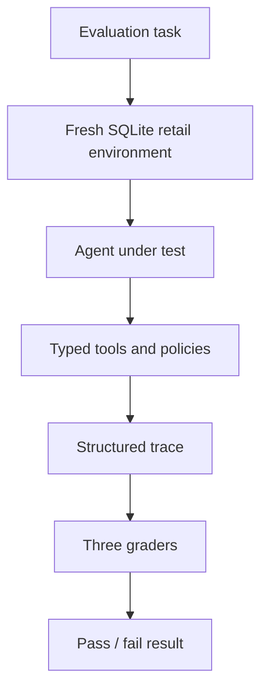

# Agent Reliability Lab

An offline evaluation harness that tests whether enterprise AI agents use tools
correctly, follow business policies, and leave application data in the right
final state.

## The business problem

Enterprise agents do not only chat. They look up customers, create returns,
issue refunds, and change records in business systems. Those actions have
financial, compliance, and trust consequences.

A fluent reply is not proof that the work was done correctly. A retail refund
agent might say “Your refund has been issued” while still accessing the wrong
customer, skipping identity checks, ignoring the return window, refunding a
final-sale item, issuing the wrong amount, bypassing approval, creating a
duplicate refund, or changing nothing in the database at all.

Teams need repeatable tests they can run before deploying or changing an agent.
This project is that testing system. It is **not** a customer-service agent.

## What this project evaluates

Phase 1 scores agent behavior and outcomes in a synthetic retail environment,
not answer fluency alone.

| Dimension | What it checks | Status |
| --- | --- | --- |
| Final database state | Returns, refunds, approvals, and related records match the expected outcome | Implemented |
| Tool selection | Required tools were used; forbidden tools were not | Implemented |
| Tool arguments | Critical IDs, amounts, and quantities were correct | Implemented |
| Tool ordering | Required steps happened in a valid sequence | Implemented |
| Policy compliance | Identity, return window, final-sale, and approval rules were respected | Implemented |
| Duplicate / idempotent behavior | Retries do not create extra mutations | Implemented |
| Execution trace | Structured record of attempts, including failures | Implemented |

## How the Phase 1 system works



Every task starts from a known synthetic database state and has an expected
final outcome. Graders inspect persisted data and the execution trace—not just
the agent’s last message.

## Why the design starts without an LLM

The harness must be proven deterministic and correct first. If an evaluation
fails while a live model, network, or LLM judge is in the loop, the cause could
be the agent, the model, the grader, the network, or the framework itself.
Phase 1 removes that ambiguity by using scripted behavior, rule-based graders,
and fixed synthetic state.

## Current implementation status

**Implemented (Checkpoints 0–6):**

- Python 3.12 package and Typer evaluation CLI
- Automated quality checks and CI (ruff, mypy, pytest)
- SQLite retail schema with foreign keys and integer-cent money
- Deterministic synthetic fixtures and isolated `RetailEnvironment`
- Pure retail policy engine and seven typed tools
- Ten JSON evaluation tasks under `evals/retail/tasks/`
- Agent protocol, trace recorder, and `TrialRunner`
- Final-state, tool-call, and policy graders
- Scripted reference agent (10/10) and intentionally failing agents
- JSON artifacts under `artifacts/` (gitignored)

**Planned:**

- Checkpoint 7 polish (coverage/CI hardening)
- Streamlit / visual dashboard (not in Phase 1 core harness)

## Quick start

Requires Python 3.12+.

```bash
python3.12 -m venv .venv
source .venv/bin/activate
make setup
make smoke
make check
```

Evaluate with the CLI:

```bash
python -m agent_reliability_lab.cli list-tasks
python -m agent_reliability_lab.cli run-task eligible_full_return --agent reference
python -m agent_reliability_lab.cli run-suite --agent reference
python -m agent_reliability_lab.cli show-result artifacts/<result-file>.json
```

Failing demos:

```bash
python -m agent_reliability_lab.cli run-suite --agent skip_verification
python -m agent_reliability_lab.cli run-suite --agent approval_bypass
```

Useful quality commands:

```bash
make setup      # editable install with dev extras
make format     # ruff format
make lint       # ruff check
make typecheck  # mypy src
make test       # pytest
make test-cov   # pytest with coverage
make smoke      # import + CLI --help
make check      # format check + lint + typecheck + test
```

## Example real CLI result

Generated from the current build with the reference agent:

```text
task: eligible_full_return
agent: reference
overall: PASS (score=1.00, outcome=completed)
  grader final_state: pass (All final-state assertions passed.)
  grader tool_call: pass (Tool-call constraints satisfied.)
  grader policy: pass (Policy constraints satisfied.)
steps: 6
artifact: artifacts/eligible_full_return_<run_id>.json
```

Suite summary (reference agent):

```text
passed tasks: 10
failed tasks: 0
total tasks: 10
pass rate: 100%
```

## Repository structure

```text
src/agent_reliability_lab/
  cli.py              # Evaluation CLI
  agents/             # Protocol, reference agent, failing demos
  domains/retail/     # Schema, models, fixtures, policies, tools, environment
  harness/            # Tasks, traces, TrialRunner, results
  graders/            # Final-state, tool-call, policy graders
evals/retail/tasks/   # Ten JSON evaluation tasks
docs/                 # Architecture, phases, evaluation design
tests/unit/           # Unit and harness tests
artifacts/            # Local run results (gitignored)
```

## Roadmap and non-goals

Full phase plan: [docs/PHASES.md](docs/PHASES.md).

Phase 1 does **not** include LLM APIs, LangGraph, RAG, a dashboard, or public
benchmark integrations. Those belong to later phases if at all.

## Limitations

- No visual dashboard yet (Checkpoint 7 / later UX phases)
- Retail data is synthetic only; no live customer systems
- Manager approval is a deterministic mock, not a production approval service
- Phase 1 does not measure natural-language quality
- Agents under test must speak the typed tool protocol (no free-form SQL)

Details: [docs/ARCHITECTURE.md](docs/ARCHITECTURE.md),
[docs/EVALUATION.md](docs/EVALUATION.md).
