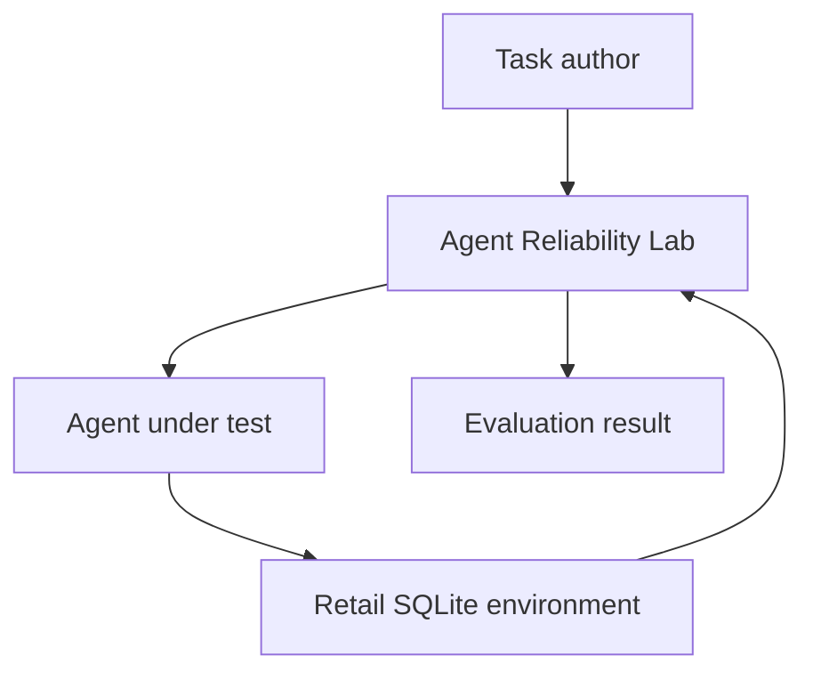
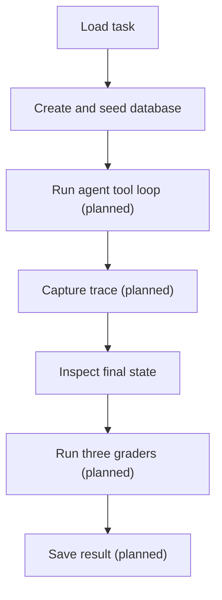
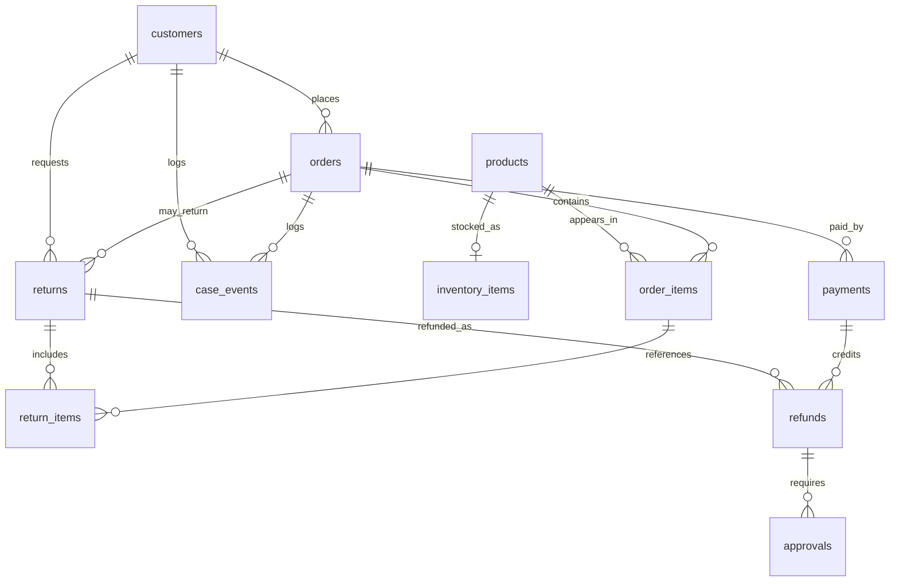

# Architecture

Agent Reliability Lab is an **evaluation harness** for agents that take actions
in business software. It is not a customer-service product. Phase 1 builds a
deterministic retail returns/refunds environment so teams can test whether an
agent used the right tools, followed policy, and left the database correct.

## 1. Purpose and system boundary

| Owned by | Responsibility |
| --- | --- |
| Agent Reliability Lab | Task definitions, environment lifecycle, tools/policies (planned), tracing (planned), graders (planned), results |
| Agent under test | Decide which tools to call and with which arguments |
| Retail environment | Synthetic SQLite “application” state: customers, orders, returns, refunds |
| Outside the system | Live LLM providers, production CRM/order systems, dashboards, public benchmarks |

Today the lab owns packaging, CLI help, and the retail SQLite environment. The
agent loop, tools, policies, traces, and graders remain planned.

## 2. Business failure model

A convincing answer can still hide a bad action. Phase 1 targets these failure
modes:

| Failure | Detection mechanism | Status |
| --- | --- | --- |
| Wrong customer | Identity and ownership policy checks | Planned |
| Ineligible return | Return-window / final-sale policy | Planned |
| Incorrect refund amount or record | Final-state grader against persisted rows | Planned |
| Approval bypass | Policy grader (high-value refund rules) | Planned |
| Duplicate mutation | Idempotency keys + tool-call / policy checks | Schema keys implemented; checks planned |
| Fluent answer but no state change | Persisted-state assertions in final-state grader | Planned |

Unique `idempotency_key` columns on returns and refunds already exist in the
schema. Policy functions and graders that use them are not implemented yet.

## 3. Architecture principles

1. **Deterministic before probabilistic** — prove the harness before adding models.
2. **SQLite as source of truth** — grade what was persisted, not chat text alone.
3. **Fresh environment per task** — no shared database across evaluations.
4. **Explicit typed boundaries** — Pydantic models at edges; no loose dicts as contracts.
5. **Tools separate from tracing** — domain tools must not own harness recording.
6. **Graders separate from the agent** — the agent does not score itself.
7. **Business denials ≠ system errors** — a policy refusal is a valid outcome; a crash is not.
8. **Honest status** — documents and code comments distinguish implemented from planned.

## 4. System context

The lab creates the environment, runs the agent against typed tools (planned),
captures a trace (planned), and grades the outcome (planned).

## 5. Phase 1 execution flow

**Implemented today:** create schema, seed a deterministic fixture, inspect rows
through an isolated `RetailEnvironment`, then clean up the temporary file.

**Still planned:** JSON task loading, agent tool loop, tracing, graders, and
result artifacts.

## 6. Component responsibilities

| Component | Responsibility | Status | Important boundary |
| --- | --- | --- | --- |
| `cli.py` | User entrypoint | Implemented: `--help` / `--version` | Must not embed domain SQL or grading logic |
| `agents/` | Agent protocol and scripted reference agent | Planned (package stub) | Agents call tools; they do not write graders |
| `domains/retail/` | Schema, models, fixtures, environment; later policies/tools | Schema/models/seed/env implemented; policies/tools planned | SQLite is the system of record |
| `harness/` | Task models, isolation, runner, traces | Planned (package stub) | Owns tracing; tools do not |
| `graders/` | Final-state, tool-call, policy graders | Planned (package stub) | Read DB + trace; do not call LLMs in Phase 1 |
| `evals/retail/tasks/` | JSON evaluation task definitions | Planned (directory not created yet) | Tasks declare expected outcomes, not agent code |
| `artifacts/` | Machine-readable run results | Planned (gitignored path) | Local only; no secrets |

## 7. Implemented data architecture

Checkpoint 1 lives under `src/agent_reliability_lab/domains/retail/`:

| Module | Role |
| --- | --- |
| `database.py` | Explicit SQL schema, `connect`, `initialize_schema`, `transaction`, row converters |
| `models.py` | Pydantic 2 boundary models and enums (no DB handles) |
| `seed.py` | Deterministic synthetic fixtures keyed by `fixture_id` |
| `environment.py` | Per-run temporary file-backed DB lifecycle |

Design details that make evaluation trustworthy:

- **Explicit SQL** — constraints and queries stay visible; no ORM
- **Foreign-key enforcement** — `PRAGMA foreign_keys = ON` on every connection
- **Transactions** — `transaction()` commits on success and rolls back on failure
- **Integer cents** — money never uses floats
- **UTC timestamps** — timezone-aware values stored as ISO strings
- **Fixed `REFERENCE_TIME`** — fixtures never call `datetime.now()`
- **Stable synthetic IDs** — human-readable, repeatable identifiers
- **File-backed temporary databases** — not SQLite `:memory:` as the system of record
- **Cleanup and isolation** — each `RetailEnvironment` deletes its file on close
- **No ORM** — teaching and grading stay close to the SQL that defines truth

## 8. Retail data model

Returns and refunds also carry unique `idempotency_key` values so duplicate
mutations can be rejected at the database layer once tools write through them.

Ten fixture IDs are registered today, including scenarios for eligible and
expired returns, final sale, partial return, high-value refund, verification
failure, cross-customer access, already refunded, missing order, and
idempotent retry. Data sources remain synthetic only; see
[DATA_SOURCES.md](DATA_SOURCES.md).

## 9. Planned evaluation architecture

Boundaries planned for later Phase 1 checkpoints:

| Piece | Expected ownership |
| --- | --- |
| Typed policy functions | `domains/retail/` — pure business rules |
| Typed tools | `domains/retail/` — mutate or read SQLite; return structured results |
| Runner-owned tracing | `harness/` — wrap tool execution; tools must not record traces themselves |
| Task definitions | `evals/retail/tasks/` — input, fixture, expected state/tool constraints |
| Final-state grader | Persist assertions on task-relevant rows |
| Tool-call grader | Required/forbidden tools, arguments, ordering, duplicates |
| Policy grader | AuthZ, return window, final sale, approvals, cross-customer rules |
| Scripted reference agent | Deterministic happy-path and failing trajectories without an LLM |

See also [EVALUATION.md](EVALUATION.md) for the intended grader contracts.

## 10. Trust and safety boundaries

| Control | Status |
| --- | --- |
| Synthetic data only | Implemented |
| No shared database between tasks | Implemented (`RetailEnvironment` isolation) |
| Transaction rollback on failed writes | Implemented at the DB helper layer |
| Unique return/refund idempotency keys | Implemented in schema |
| Cross-customer access prevention in tools/policies | Planned |
| Trace redaction / no secrets in traces | Planned |
| Rule-based graders (no LLM-as-judge in Phase 1) | Planned |

Temporary `*.db` files and `artifacts/` are gitignored.

## 11. Design decisions and trade-offs

| Decision | Why | Trade-off |
| --- | --- | --- |
| Deterministic first vs immediate LLM integration | Isolate harness bugs from model variance | Phase 1 does not score natural language |
| SQLite vs in-memory-only state | Grade real persistence and constraints | Slightly more lifecycle code |
| Explicit SQL vs ORM | Visible constraints for teaching and evaluation | More hand-written SQL |
| Synthetic fixtures vs public transaction datasets | Stable, private, license-safe seeds | Less “messy world” realism |
| Rule-based graders vs LLM-as-judge | Repeatable CI and clear failures | Policies must be encoded explicitly |

Background ADR: [decisions/0001-deterministic-first.md](decisions/0001-deterministic-first.md).

## 12. Current status and next step

**Checkpoints 0 and 1 are implemented:** packaging/CLI/tooling, and the SQLite
retail schema, models, fixtures, and isolated environment.

**Checkpoint 2 is next:** add retail policies and typed tools on top of this
environment so agents can take constrained actions worth grading.

Roadmap: [PHASES.md](PHASES.md).
