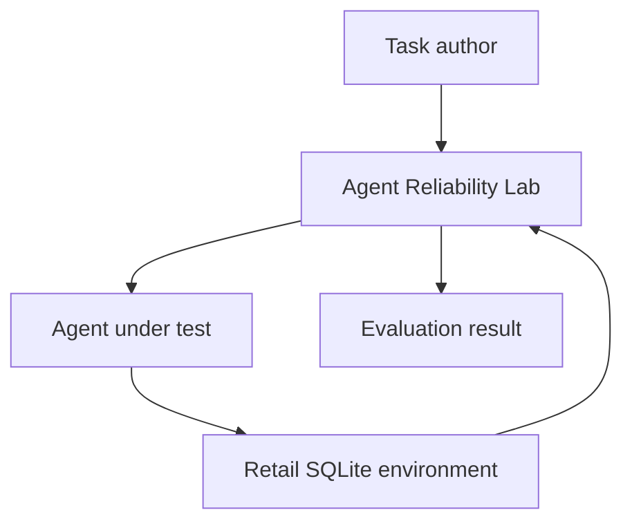
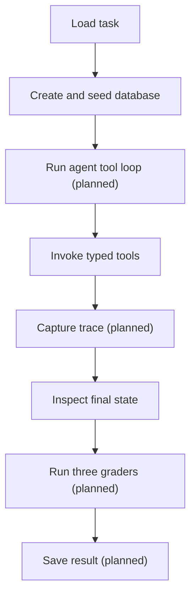
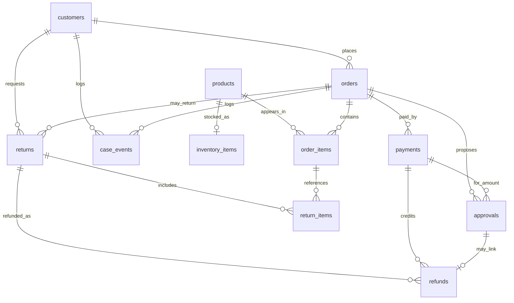
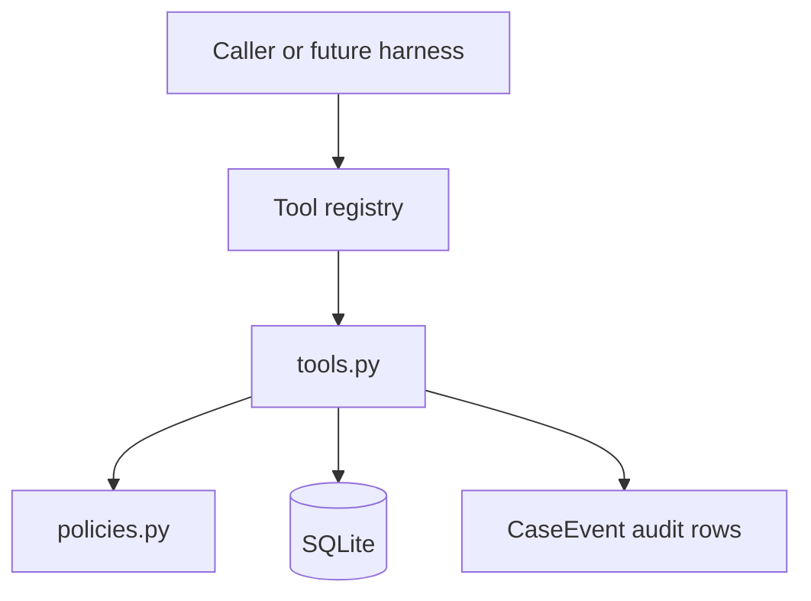

# Architecture

Agent Reliability Lab is an **evaluation harness** for agents that take actions
in business software. It is not a customer-service product. Phase 1 builds a
deterministic retail returns/refunds environment so teams can test whether an
agent used the right tools, followed policy, and left the database correct.

## 1. Purpose and system boundary

| Owned by | Responsibility |
| --- | --- |
| Agent Reliability Lab | Task definitions, environment lifecycle, tools/policies, tracing (planned), graders (planned), results |
| Agent under test | Decide which tools to call and with which arguments |
| Retail environment | Synthetic SQLite “application” state: customers, orders, returns, refunds |
| Outside the system | Live LLM providers, production CRM/order systems, dashboards, public benchmarks |

Today the lab owns packaging, CLI help, the retail SQLite environment, pure
policies, and typed tools. The agent loop, traces, graders, and evaluation CLI
remain planned.

## 2. Business failure model

A convincing answer can still hide a bad action. Phase 1 targets these failure
modes:

| Failure | Detection mechanism | Status |
| --- | --- | --- |
| Wrong customer | Identity and ownership policies in tools | Implemented in tools/policies |
| Ineligible return | Return-window / final-sale policy | Implemented in tools/policies |
| Incorrect refund amount or record | Final-state grader against persisted rows | Planned |
| Approval bypass | High-value refund requires deterministic approval | Enforced in tools; grader planned |
| Duplicate mutation | Idempotency keys + tool replay handling | Implemented in tools |
| Fluent answer but no state change | Persisted-state assertions in final-state grader | Planned |

## 3. Architecture principles

1. **Deterministic before probabilistic** — prove the harness before adding models.
2. **SQLite as source of truth** — grade what was persisted, not chat text alone.
3. **Fresh environment per task** — no shared database across evaluations.
4. **Explicit typed boundaries** — Pydantic models at edges; no loose dicts as contracts.
5. **Tools separate from tracing** — domain tools must not own harness recording.
6. **Graders separate from the agent** — the agent does not score itself.
7. **Business denials ≠ system errors** — a policy refusal is a valid outcome; a crash is not.
8. **Honest status** — documents and code comments distinguish implemented from planned.

## 4. System context

The lab creates the environment and exposes typed tools. Capturing a harness
trace and grading outcomes remain planned.

## 5. Phase 1 execution flow

**Implemented today:** create schema, seed a deterministic fixture, run pure
policies and seven typed tools through an isolated `RetailEnvironment`, then
clean up the temporary file.

**Still planned:** JSON task loading, agent loop, tracing, graders, and result
artifacts.

## 6. Component responsibilities

| Component | Responsibility | Status | Important boundary |
| --- | --- | --- | --- |
| `cli.py` | User entrypoint | Implemented: `--help` / `--version` | Must not embed domain SQL or grading logic |
| `agents/` | Agent protocol and scripted reference agent | Planned (package stub) | Agents call tools; they do not write graders |
| `domains/retail/` | Schema, models, fixtures, environment, policies, tools | Implemented through Checkpoint 2 | SQLite is the system of record; policies stay pure |
| `harness/` | Task models, isolation, runner, traces | Planned (package stub) | Owns tracing; tools do not |
| `graders/` | Final-state, tool-call, policy graders | Planned (package stub) | Read DB + trace; do not call LLMs in Phase 1 |
| `evals/retail/tasks/` | JSON evaluation task definitions | Planned (directory not created yet) | Tasks declare expected outcomes, not agent code |
| `artifacts/` | Machine-readable run results | Planned (gitignored path) | Local only; no secrets |

## 7. Implemented data architecture

Retail domain code lives under `src/agent_reliability_lab/domains/retail/`:

| Module | Role |
| --- | --- |
| `database.py` | Explicit SQL schema, `connect`, `initialize_schema`, `transaction`, row converters |
| `models.py` | Pydantic 2 boundary models and enums (no DB handles) |
| `seed.py` | Deterministic synthetic fixtures keyed by `fixture_id` |
| `environment.py` | Per-run temporary file-backed DB lifecycle |
| `policies.py` | Pure policy decisions and stable codes |
| `tools.py` | Typed tools, `ToolResult`, registry/dispatcher |

Design details that make evaluation trustworthy:

- **Explicit SQL** — constraints and queries stay visible; no ORM
- **Foreign-key enforcement** — `PRAGMA foreign_keys = ON` on every connection
- **Transactions** — `transaction()` commits on success and rolls back on failure
- **Integer cents** — money never uses floats
- **UTC timestamps** — timezone-aware values stored as ISO strings
- **Fixed `REFERENCE_TIME`** — fixtures never call `datetime.now()`
- **Stable synthetic IDs** — human-readable, repeatable identifiers
- **File-backed temporary databases** — not SQLite `:memory:` as the system of record
- **Cleanup and isolation** — each `RetailEnvironment` deletes its file on close
- **No ORM** — teaching and grading stay close to the SQL that defines truth

## 8. Retail data model

### Approval schema evolution (Checkpoint 2)

Checkpoint 1 linked each approval to a required `refund_id`, which could not
model manager approval **before** refund creation. Checkpoint 2 evolves the
fresh schema (no migration framework) to:

| Column | Role |
| --- | --- |
| `approval_id` | Primary key (caller-provided, stable) |
| `order_id` | Order being refunded |
| `payment_id` | Payment being credited |
| `amount_cents` | Proposed refund amount |
| `status` | `pending` / `approved` / `denied` |
| `requested_at` / `resolved_at` | Lifecycle timestamps |
| `refund_id` | **Nullable** until `create_refund` links the completed refund |

Returns and refunds also carry unique `idempotency_key` values so duplicate
mutations can be rejected and safely replayed.

Ten fixture IDs are registered today, including scenarios for eligible and
expired returns, final sale, partial return, high-value refund, verification
failure, cross-customer access, already refunded, missing order, and
idempotent retry. Data sources remain synthetic only; see
[DATA_SOURCES.md](DATA_SOURCES.md).

## 9. Policy and tool architecture

### Separation of layers

| Layer | Owns | Must not |
| --- | --- | --- |
| Policy | Pure business decisions (`PolicyDecision`) | SQL, DB connections, wall clock, trace recording |
| Tool | Typed I/O, SQLite queries/mutations, policy invocation | Direct TraceRecorder dependency |
| Harness (planned) | Trace wrapping around `invoke_tool` | Domain business rules |

`CaseEvent` rows are business/audit state inside the retail environment. They
are **not** harness execution traces.

### Policy decision contract

`PolicyDecision` contains:

- `allowed: bool`
- `code: PolicyCode` (stable machine-readable enum)
- `reason: str` (concise human-readable explanation)
- `evidence: dict` (structured, no unnecessary PII)

Expected business denials do not raise exceptions. Unexpected programming or
database failures must not be silently converted into policy denials.

Key constants:

- Return window: **30 days** from delivery (day 30 inclusive)
- Manager approval threshold: amounts **above 50,000 cents** require approval

### Tool contract

Each tool has a dedicated Pydantic input model. Every tool returns `ToolResult`:

- `ok`, `code`, `message`, `data`, `idempotent_replay`

Outputs use integer cents and ISO-8601 UTC timestamps, avoid email/phone and
verification credentials, and are JSON-serializable.

Exact tool names:

1. `verify_customer`
2. `get_order`
3. `check_return_eligibility`
4. `request_manager_approval`
5. `create_return`
6. `create_refund`
7. `get_refund_status`

The tool registry lists names, exposes input JSON schemas, validates arguments,
and invokes handlers. It does **not** record traces.

### Verification-session design

`customers.verified` means the synthetic account **can** be verified. It does
not prove the current tool session completed verification.

`verify_customer` matches typed `email` / `phone` credentials (names chosen so
future harness redaction is easy) and, on success, writes an idempotent
`CaseEvent` with `event_type=verification` (`case_event_id=verif_{customer_id}`).
Sensitive tools require that event for the customer in the current
`RetailEnvironment`. Cross-customer verification does not authorize another
customer’s order.

### Deterministic approval mock

`request_manager_approval` simulates an external manager approval system for
valid high-value synthetic requests. For the valid high-value fixture it creates
an `approved` approval that can authorize `create_refund`. Agents must call this
tool; they cannot pass a free-form approval decision. This is a deterministic
mock, not a production approval service.

### Transaction and idempotency behavior

Mutating tools use `transaction()` so multi-row writes are atomic. Exact
`idempotency_key` replay for returns and refunds returns the existing record
with `idempotent_replay=True` and does not create duplicates. Over-return under
a different key is denied. High-value refunds without a matching approved
approval are denied.

Phase 1 `create_return` stores returns as `approved` so a later refund can
proceed without a separate approval workflow for the return itself.

## 10. Planned evaluation architecture

Boundaries planned for later Phase 1 checkpoints:

| Piece | Expected ownership |
| --- | --- |
| Runner-owned tracing | `harness/` — wrap tool execution; tools must not record traces themselves |
| Task definitions | `evals/retail/tasks/` — input, fixture, expected state/tool constraints |
| Final-state grader | Persist assertions on task-relevant rows |
| Tool-call grader | Required/forbidden tools, arguments, ordering, duplicates |
| Policy grader | AuthZ, return window, final sale, approvals, cross-customer rules |
| Scripted reference agent | Deterministic happy-path and failing trajectories without an LLM |

See also [EVALUATION.md](EVALUATION.md) for the intended grader contracts.

## 11. Trust and safety boundaries

| Control | Status |
| --- | --- |
| Synthetic data only | Implemented |
| No shared database between tasks | Implemented (`RetailEnvironment` isolation) |
| Transaction rollback on failed writes | Implemented |
| Unique return/refund idempotency keys | Implemented in schema and tools |
| Cross-customer access prevention in tools/policies | Implemented |
| Session verification before sensitive tools | Implemented |
| Trace redaction / no secrets in traces | Planned |
| Rule-based graders (no LLM-as-judge in Phase 1) | Planned |

Temporary `*.db` files and `artifacts/` are gitignored.

## 12. Design decisions and trade-offs

| Decision | Why | Trade-off |
| --- | --- | --- |
| Deterministic first vs immediate LLM integration | Isolate harness bugs from model variance | Phase 1 does not score natural language |
| SQLite vs in-memory-only state | Grade real persistence and constraints | Slightly more lifecycle code |
| Explicit SQL vs ORM | Visible constraints for teaching and evaluation | More hand-written SQL |
| Synthetic fixtures vs public transaction datasets | Stable, private, license-safe seeds | Less “messy world” realism |
| Rule-based graders vs LLM-as-judge | Repeatable CI and clear failures | Policies must be encoded explicitly |
| Approval before refund | High-value refunds need proposal then completion | Schema evolved from refund-linked approvals |

Background ADR: [decisions/0001-deterministic-first.md](decisions/0001-deterministic-first.md).

## 13. Current status and next step

**Checkpoints 0–2 are implemented:** packaging/CLI/tooling; SQLite retail
schema, models, fixtures, and environment; pure policies and seven typed tools.

**Checkpoint 3 is next:** add ten validated JSON evaluation tasks that exercise
these tools under controlled fixtures.

Roadmap: [PHASES.md](PHASES.md).
